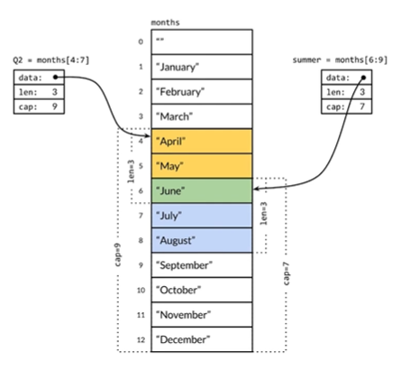

# Go - 切片（slice）

切片（slice）就是一种简化版的动态数组。

切片类型只是指向数组的窗口或视图而已。每一个切片都构建于一个底层的数组之上。实际上是底层的数组存储了切片的数据；切片仅仅是数组中的一部分（或者所有）元素的视图。

切片是一个可以通过增长来保存额外数据的集合类型，它是Go的一个数据结构。

与数组相同的是，切片由多个相同类型的元素构成。不同的是，切片允许我们在结尾追加更多的元素。

切片的结构定义，即reflect.SliceHeader：

```go
type SliceHeader struct {
	Data uintptr
	Len int
	Cap int
}
```

Cap成员表示切片指向的内存空间的最大容量（对应元素的个数，而不是字节数）。

关键点总结：

- 切片是数组的一个引用，因此切片是引用类型
- 切片的遍历、元素的访问和切片长度计算（len(slice)）都和数组一样。
- 切片的长度可以动态变化


## 切片的定义方式

```go
var (
	a []int               // nil切片，和nil相等，一般用来表示一个不存在的切片
	b = []int{}           // 空切片，和nil不相等，一般用来表示一个空的集合
    //切片字面量
	c = []int{1, 2, 3}    // 有3个元素的切片，len和cap都为3
    //通过其他切片来创建切片
	d = c[:2]             // 有2个元素的切片，len为2，cap为3
	e = c[0:2:cap(c)]     // 有2个元素切片，len为2，cap为3
	f = c[:0]             // 有0个元素的切片，len为0，cap为3
    // 通过make函数创建切片
	g = make([]int, 3)    // 有3个元素的切片，len和cap都为3
	h = make([]int, 2, 3) // 有2个元素的切片，len为2，cap为3
	i = make([]int, 0, 3) // 有0个元素的切片，len为0，cap为3
)
```

内置的len()函数返回切片中有效元素的长度。

内置的cap()函数返回切片容量大小，容量必须大于或等于切片的长度。容量通常来自于底层数组的长度。

切片可以和nil进行比较，只有当切片底层数据指针为空时切片本身才为nil，这时候切片的长度和容量信息将是无效的。（如果有切片的底层数据指针为空，但是长度和容量不为0的情况，那么说明切片本身已经被损坏了）

在对切片本身进行赋值或参数传递时，和数组指针的操作方式类似，但是只复制切片头信息（reflect.SliceHeader），而不会复制底层的数据。对于类型，和数组的最大不同是，切片的类型和长度信息无关，只要是相同类型元素构成的切片均对应相同的切片类型。

切片是一种简化版的动态数组，这是切片类型的灵魂。

使用make方式创建切片时：

- 可以指定切片大小和容量
- 如果没有给切片的各个元素赋值，那么每个元素默认为零值。
- 对应的底层数组由make底层维护，对外不可见，即只能通过slice进行操作。


#### 切片运算符（不推荐，需要关注底层数组对切片的影响）

创建一个数组，然后再基于数组通过切片运算符创建一个切片。

```go
myArray := [5]int{1, 2, 3, 4, 5}	//创建一个数组
mySlice := myArray[1:3]				//基于数组创建切片
fmt.Println(mySlice)				
```

输出：

```
[2 3]
```

切片运算符有两个索引：其中一个标识切片开始的位置，另一个标识切片在此位置之前结束。

> 如果你使用`underlyingArray[i：j]`作为切片的运算符，生成的切片实际上包含元素`underlyingArray[i]`到元素`underlyingArray[j-1]`。

切片运算符默认需要两个索引。

如果忽略了开始的索引，默认从0开始；如果忽略了结束索引，默认取剩余的全部元素。

```go
myArray := [5]int{1, 2, 3, 4, 5}
mySlice = myArray[:4]
fmt.Println(mySlice)	//输出：[1 2 3 4]
mySlice = myArray[3:]
fmt.Println(mySlice)	//输出：[4 5]
```


## 切片相关的操作

### 添加切片元素

Go提供一个内建的函数append来将一个或者多个值追加到切片的末尾或开头，并返回追加后的切片。

#### 在切片的尾部追加元素

```go
mySlice := []int{1, 2, 3}
mySlice = append(mySlice, 4)    //追加一个元素
mySlice = append(mySlice, 5, 6) //同时追加两个元素
fmt.Println(mySlice)            //输出：[1 2 3 4 5 6 7 8]
// 在切片末尾追加一个切片，切片需要解包
mySlice = append(mySlice, []int{7, 8}...)
fmt.Printf("%#v", mySlice) //输出：[]int{1, 2, 3, 4, 5, 6, 7, 8}
```

需要注意的是，在容量不足的情况下，append ()操作会导致重新分配内存，可能导致巨大的内存分配和复制数据的代价。即使容量足够，依然需要用append()函数的返回值来更新切片本身，因为新切片的长度已经发生了变化。

> 切片的底层数组并不能增长大小。如果数组没有足够的空间来保存新的元素，所有的元素会被拷贝至一个新的更大的数组，并且切片会被更新为引用这个新的数组。但是由于这些场景都发生在append函数内部，无法知道返回的切片与传入append函数的切片是否具有相同的底层数组。如果你保留了两个切片，会导致一些非预期的错误。

注意：切片是底层数组的视图，当使用append()添加元素时，会出现不同切片具有相同或不同的底层数组的情况。例如：

```go
s1 := []int{1, 2, 3}
s2 := append(s1, 4, 5)
s2[0] = 0           //更改了s2的第一个元素，s1没发生变化
fmt.Println(s1, s2) //此处输出：[1 2 3] [0 2 3 4 5]，s1的值并没有被改变
s3 := append(s2, 6, 7)
s4 := append(s3, 8, 9, 10)
fmt.Println(s3, s4) //此处输出：[0 2 3 4 5 6 7] [0 2 3 4 5 6 7 8 9 10]
s4[0] = 111         //更改s4的第一个元素，发现对应的s3的第一个元素也发生了改变
fmt.Println(s3, s4) //输出：[111 2 3 4 5 6 7] [111 2 3 4 5 6 7 8 9 10]
```

上述代码中，特定情况下，可能共享同一个底层数组，此时对一个切片的更改，会影响共享该底层数组的其他切片的值。

因此调用append函数，惯例是将函数的返回值赋给你传入的那个切片变量。如果你只保存一个切片，你就无须考虑两个切片是否共享了同一个底层数组。

如果为append函数传入nil切片，它会当做一个空的切片来处理，append函数会在幕后创建一个切片，并返回添加了元素之后的切片。

因此，不用担心为append函数传入的切片变量是否是nil还是空，都可以正常被处理。

#### 在切片的开头追加元素（不推荐）

```go
mySlice = append([]int{0}, mySlice...)       //在开头添加一个元素0，注意最后面的3个点是必须有的
mySlice = append([]int{-3, -2, -1}, mySlice...) // 在开头添加一个切片
fmt.Printf("%#v", mySlice)                      
//输出：[]int{-3, -2, -1, 0, 1, 2, 3, 4, 5, 6, 7, 8}
```

在开头一般都会导致内存的重新分配，而且会导致已有的元素全部复制一次。因此，从切片的开头添加元素的性能一般要比从尾部追加元素的性能差很多。

#### 在切片中间插入元素

##### 方式一（不推荐）：使用append()链式操作

在索引为i的位置插入元素x：

```go
mySlice = append(mySlice[:i], append([]int{x}, mySlice[i:]...)...)
```

例如：

```go
//在索引为2的位置插入66
mySlice = append(mySlice[:2], append([]int{66}, mySlice[2:]...)...)
```

在索引为i的位置插入切片：

```
mySlice = append(mySlice[:i], append([]int{51, 52, 53}, mySlice[i:]...)...)
```

例如：

```go
//在索引为5个位置插入切片
mySlice = append(mySlice[:5], append([]int{51, 52, 53}, mySlice[5:]...)...)
```

每个添加操作中的第二个append ()调用都会创建一个临时切片，并将a[i:]的内容复制到新创建的切片中，然后将临时创建的切片再追加到a[:i]。

##### 方式二（推荐）：使用copy()和append()组合

使用copy()和append()组合可以避免创建中间的临时切片。

向指定位置的切片添加元素的操作：

```go
mySlice = append(mySlice, 0)     //切片扩展一个空间
copy(mySlice[i+1:], mySlice[i:]) //mySlice[i:]向后移动一个位置
mySlice[i] = x                   //设置新添加的元素
```

例如：

```go
mySlice = append(mySlice, 0)     //扩展切片长度，为要插入的元素留出空间
copy(mySlice[2+1:], mySlice[2:]) //将要插入位置开始之后的元素向后挪动一个位置
mySlice[2] = 100                 //将新添加的元素赋值到对应的位置
```

在中间位置插入多个元素（也就是插入一个切片）:

```go
mySlice = append(mySlice, x...)       //为新切片扩展足够的空间
copy(mySlice[i+len(x):], mySlice[i:]) //mySlice[i:]向后移动len(x)个位置
copy(mySlice[i:], x)                  //复制新添加的切片
```

例如：

```go
var x = []int{97, 98, 99}
mySlice = append(mySlice, x...)       //为新切片扩展足够的空间
copy(mySlice[2+len(x):], mySlice[2:]) //mySlice[2:]向后移动len(x)个位置
copy(mySlice[2:], x)                  //复制新添加的切片
```

### 删除切片元素

根据要删除元素的位置，有从开头位置删除、从中间位置删除和从尾部删除3种情况，其中删除切片尾部的元素最快。

#### 从尾部删除

删除尾部N个元素：

```go
mySlice = mySlice[:len(mySlice)-N] //删除尾部N个元素
```

例如：

```go
mySlice = mySlice[:len(mySlice)-1] //删除尾部1个元素
```

#### 从开头位置删除

##### 方式一：通过移动数据指针来删除开头的元素

删除开头N个元素：

```go
mySlice = mySlice[N:] //删除开头N个元素
```

例如：

```go
mySlice = mySlice[1:] //删除开头一个元素
```

##### 方式二：使用append()原地完成来删除开头的元素

所谓原地完成是指在原有的切片数据对应的内存区间内完成，不会导致内存空间结构的变化。

删除开头N个元素：

```go
mySlice = append(mySlice[:0], mySlice[N:]...) 
```

例如：

```go
mySlice = append(mySlice[:0], mySlice[1:]...) //删除开头一个元素
```

##### 方式三：使用copy()完成删除开头的元素

删除开头N个元素：

```go
mySlice = mySlice[:copy(mySlice, mySlice[N:])]
```

例如：

```go
mySlice = mySlice[:copy(mySlice, mySlice[2:])] //删除开头2个元素
```

#### 从中间位置删除

对于删除中间的元素，需要对剩余的元素进行一次整体挪动，同样可以用append()或copy()原地完成。

##### 方式一：使用append()原地完成

删除中间N个元素：

```go
//从索引为i的位置删除N个元素
mySlice = append(mySlice[:i], mySlice[i+N:]...)
```

例如：

```
mySlice = append(mySlice[:2], mySlice[2+3:]...) //从索引为2的位置删除3个元素
```

##### 方式二：使用copy()实现

删除中间N个元素：

```go
//从索引为i的位置删除N个元素
mySlice = mySlice[:i+copy(mySlice[i:], mySlice[i+N:])] 
```

例如：

```go
mySlice = mySlice[:3+copy(mySlice[3:], mySlice[3+4:])] //从索引为3的位置处删除4个元素
```

删除开头的元素和删除尾部的元素都可以认为是删除中间元素操作的特殊情况。

### 三索引切分操作

Go语言在1.2版本引入了能够限制新建切片容量的三索引切分操作。

```go
func main() {
	strs := []string{"AA", "BB", "CC", "DD", "EE", "FF", "GG"}
	fmt.Println(len(strs), cap(strs)) //输出：7 7
	//未指定容量
	str2 := strs[2:4]
	fmt.Println(str2) //输出：[CC DD]
	//未指定容量时，以底层数组的开始元素到末尾可见元素个数来确定
	fmt.Println(len(str2), cap(str2)) //输出：2  5

    //使用三索引切分，切片长度为3-2，容量为6-2
	str3 := strs[2:3:6] //输出：[CC]
	fmt.Println(str3)
	fmt.Println(len(str3), cap(str3)) //输出：1  4
}
```

限定切片的容量，最主要的作用是在调用append方法时，防止传入容量过大的切片，导致底层数组没有足够的空间（容量）来执行追加操作，而需要创建容量是原数组的两倍的新数组，并将元素复制到新分配的数组而带来的性能开销。

### 切片的拷贝

```go
var slice1 = []int{1, 2, 3, 4}
var slice2 = []int{10}
copy(slice2, slice1)
fmt.Println(slice2) //输出：[1]
```

上述程序中，slice2只有一个元素，使用copy()将slice1的元素拷贝到slice2中，程序不会报错，会成功的拷贝一个元素到slice2中。


## 切片内存技巧

对于切片来说，len为0但是cap容量不为0的切片是非常有用的特性。

当然，如果len和cap都为0的话，则变成一个真正的空切片，虽然它并不是一个nil的切片。==在判断一个切片是否为空时，一般通过len获取切片的长度来判断，一般很少将切片和nil做直接的比较==。

```go
a := []int{1, 2, 3, 4, 5}
b := a[:0]
fmt.Println(len(b), cap(b)) //输出：0和5
```

cap的值通常来自于底层数组的长度。

下述是利用了长度为0的切片的特性，实现高效而且简洁的函数实现的示例：

```go
//过滤字节
func Filter(s []byte, fn func(x byte) bool) []byte {
	b := s[:0]
	for _, x := range s {
		if !fn(x) {
			b = append(b, x)
		}
	}
	return b
}
```

调用方式：

```go
wy := Filter([]byte("a-b-c"),
	func(x byte) bool {
		return x == '-'
	})
fmt.Println(string(wy)) //输出：abc
```

切片高效操作的要点是要降低内存分配的次数，尽量保证append()操作不会超出cap的容量，降低触发内存分配的次数和每次分配内存的大小。

【切片的内存泄露，详见《Go语言高级编程》1.3中的”避免切片内存泄露“部分】


## 切片与函数形参

声明可变参数函数，只需要在形参前加上`...`：

```go
func say(worlds ...string) {
	//输出实参的类型
	fmt.Printf("%T", worlds) //输出：[]string
	fmt.Println(worlds)
}
```

上述代码中，形参worlds是一个字符串切片，它包含传递给say函数的零个或多个实参。

```go
say("aa", "bb", "cc")
```

虽然在say()函数的内部，输出worlds的类型是字符串切片，但是不能直接将一个字符串切片变量传递给say函数。

```go
wy := []string{"AA", "BB"}
//直接传入将会报编译错误
say(wy)
```

原因是say函数的形参表示的是可变数量参数，每个参数的类型仍然为string，只是传递的实参数量可变，如果要想say函数直接传入wy的值，需要将say定义为say(worlds []string)才可以。

对于上述代码，必须通过`...`展开切片中的元素，并将它们用作传递给函数的多个实参：

```go
say(wy...)
```


总结`...`的三种用法：

- 声明数组时，使用`...`代替指定的数组长度。例如：`var a = [...]int{1, 2}`
- 展开切片的元素
- 声明可变参数函数


## 切片和数组之间的关系

切片并不会自己保存任何数据，它仅仅是底层数组的元素的视图。

甚至可以有多个切片都指向相同的底层数组。每一个切片会是一个指向数组元素的子集的视图。

==注意：由于切片只是底层数组内容的视图，如果你修改底层数组，这些变化也会反映到切片。给切片的一个元素赋一个新值也会修改底层数组相应的元素。==

```go
myArray := [5]int{1, 2, 3, 4, 5}
mySlice := myArray[:3]
fmt.Println(mySlice) 	//输出：[1 2 3]
myArray[0] = 11	     	//修改底层数组的一个元素值
fmt.Println(mySlice) 	//输出：[11 2 3]
mySlice[1] = 22			//修改切片中的元素的值
fmt.Println(myArray) 	//输出：[11 22 3 4 5]
```

**修改底层数组的一个元素值，对应的切片的元素值也会一起被修改。同样，修改切片中的元素的值，也会修改底层数组相应的元素的值。**

==如果多个切片指向了同一个底层数组，数组的元素修改会反映给所有的切片。==



```go
func main() {
	// 声明一个数组
	var intArr = [...]int32{1, 2, 3, 4, 5} // int类型数据占用4个字节
	fmt.Printf("intArr的地址为：%p\n", &intArr)
	for i := 0; i < len(intArr); i++ {
		fmt.Printf("intArr[%d]的值为：%d\t地址为：%p\n", i, intArr[i], &intArr[i])
	}

	// 基于数组声明一个切片
	var intSlice = intArr[2:5]
	fmt.Printf("切片的长度：%d\t切片的容量：%d\n", len(intSlice), cap(intSlice))
	// 打印每个切片元素的值和地址
	for i, _ := range intSlice {
		fmt.Printf("intSlice[%d]的值为：%d\t地址为：%p\n", i, intSlice[i], &intSlice[i])
	}
    
    // 修改切片中元素的值
	intSlice[2] = 555
	// 获取底层数组的值
	for _, num := range intArr {
		fmt.Printf("%d\t", num)
	}
    
    // 修改底层数组的值
	intArr[2] = 3333
	fmt.Println("\n同样，修改了底层数组的元素之后，也会直接影响切片的值：")
	for _, num := range intSlice {
		fmt.Printf("%d\t", num)
	}
}
```

输出：

```
intArr的地址为：0xc00000c150
intArr[0]的值为：1      地址为：0xc00000c150
intArr[1]的值为：2      地址为：0xc00000c154
intArr[2]的值为：3      地址为：0xc00000c158
intArr[3]的值为：4      地址为：0xc00000c15c
intArr[4]的值为：5      地址为：0xc00000c160
切片的长度：3   切片的容量：3               
intSlice[0]的值为：3    地址为：0xc00000c158
intSlice[1]的值为：4    地址为：0xc00000c15c
intSlice[2]的值为：5    地址为：0xc00000c160
修改了切片的元素之后，底层数组也跟着修改：              
1       2       3       4       555  
同样，修改了底层数组的元素之后，也会直接影响切片的值：  
3333    4       555 
```

切片定义如下，上述代码中，intSlice切片的Data指向的就是底层数组截取的起始元素的地址。

```go
type SliceHeader struct {
	Data uintptr
	Len int
	Cap int
}
```


## 切片中元素的默认值

与数组一样，如果你访问了一个切片中没有赋值的元素，你会得到那个元素类型的零值（默认值）。

和数组不同的是，切片变量自己也有0值：nil。一个没有赋值的切片变量值为nil。如果输入参数是一个nil切片那么len返回0。

```go
fmt.Println(len(intSlice)) //把nil切片传递给len函数，它会返回0，就像传入了一个空的切片一样
```


## 切片与字符串

切分字符串将创建另一个字符串。

```go
wy := "abcde"
abc := wy[:3]
//为变量重新赋值并不会改变已切分得到的新字符串
wy = "efgh"
fmt.Println(abc) //仍然输出：abc
```

为变量wy赋予新的值，并不会改变abc的值。

注意：在切分字符串时，索引代表的是字节号码而非符文号码。

```go
zg := "中国"
s := zg[:3]
fmt.Println(s) //输出：中
```


## 数组和切片总结

### 关于类型

数组的长度是其类型的一部分，数组的长度在声明它的时候就必须给定，并且之后不会再改变。

切片的类型字面量中只有元素的类型，而没有长度。

指定了长度是数组，否则就是切片。

```go
myArray := [3]string{"a","b","c"}
mySlice := []string{"a","b","c"}
```

数组可以被叫做切片的底层数组，而切片也可以被看作是对数组的某个连续片段的引用。

Go 语言的切片类型属于引用类型，同属引用类型的还有字典类型、通道类型、函数类型等；

而 Go 语言的数组类型则属于值类型，同属值类型的有基础数据类型以及结构体类型。

（在 Go 语言中，我们判断所谓的“传值”或者“传引用”只要看被传递的值的类型就好了）

### 关于长度（len）和容量（cap）

数组的容量永远等于其长度，都是不可变的。

一个切片的容量可以被看作是透过这个窗口最多可以看到的底层数组中元素的个数。

```go
func main() {
	//创建长度为5的切片
	s1 := make([]int, 5)
	fmt.Printf("s1切片的长度：%d \n", len(s1)) //输出：5
	fmt.Printf("s1切片的容量：%d \n", cap(s1)) //输出：5
	fmt.Printf("s1切片的值：%d \n", s1)       //输出：[0 0 0 0 0]

	//创建长度为5，容量为8的切片
	s2 := make([]int, 5, 8)
	fmt.Printf("s2切片的长度：%d \n", len(s2)) //输出：5
	fmt.Printf("s2切片的容量：%d \n", cap(s2)) //输出：8
	fmt.Printf("s2切片的值：%d \n", s2)       //输出：[0 0 0 0 0]

	s3 := []int{1, 2, 3, 4, 5, 6, 7, 8}
	s4 := s3[3:6]
	fmt.Printf("s4切片的长度：%d \n", len(s4)) //输出：3
	fmt.Printf("s4切片的容量：%d \n", cap(s4)) //输出：5
	fmt.Printf("s4切片的值：%d \n", s4)       //输出：[4 5 6]
}
```

由于s4是通过在s3上施加切片操作得来的，所以s3的底层数组就是s4的底层数组。

又因为，在底层数组不变的情况下，切片代表的窗口可以向右扩展，直至其底层数组的末尾。所以，s4的容量就是其底层数组的长度8, 减去s4所在的起始索引3，最终算出容量为5。

注意，切片代表的窗口是无法向左扩展的。也就是说，我们永远无法透过s4看到s3中最左边的那 3 个元素。

在使用append函数添加元素时，如果无需扩容，append函数返回的是指向**原**底层数组的**原**切片，而在需要扩容时，append函数返回的是指向**新**底层数组的**新**切片。