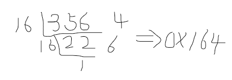

# Go - 二进制、八进制、十六进制、位运算符

对于整数类型的数据，有四种表达方式。

- 二进制（%b）
- 十进制（%d）
- 八进制（%o）
- 十六进制（%x）


## 二进制（%b）

二进制（Binary）数用0和1两个数字及其组合来表示任何数，进位规则是“逢二进一”，数字1在不同的位上代表不同的值，按从右到左的次序，这个值以二倍递增。

在计算机的内部，运行各种运算时，都是以二进制的方式来运行。

二进制运算牵扯到三个概念：原码、反码和补码。

有符号整数：int、int8、int16、int32（rune）、int64

无符号整数：uint、uint8（byte）、uint16、uint32、uint64

**有符号整数的n位数字的取值范围是： -2^n-1^ ~ 2^(n-1）^-1，==由于需要保留最高位作为符号位来表示正数或者负数，因此在次方上减1==。例如，int8的取值范围为：-128 ~ 127**。

**无符号整数的n位数字的取值范围是： 0 ~ 2^n^-1，无符号整数都是非负数。例如，uint8的取值范围为：0 ~ 255**。

二进制：0~1，满2进1。

在Golang中，不能直接使用二进制表示一个整数，它沿用了C语言的特点。

如果要将一个整数作为二进制输出，可以使用如下方式：

```go
// 二进制输出
fmt.Printf("%b", 10) //输出：1010

//输出16对应的10进制和二进制表示形式
fmt.Printf("%d：%b \n", 16, 16) //16：10000

//输出指定位数的10进制和二进制表示形式，%08b表示显示8个位数，不足的前面补0
fmt.Printf("%3d：%08b \n", 16, 16) // 16：00010000（16的前面有一个空格）
```


### 原码、反码、补码

对于有符号的数而言：

- 二进制的最高位是符号位：0表示正数，1表示负数；
- 正数的原码、反码、补码都相同；
- 负数的反码=它的原码符号位不变，其他位取反（0变为1,1变为0）；
- 负数的补码=它的反码+1（负数的反码=它的补码-1）
- 0的反码、补码都是0；
- ==在计算机运算的时候，都是以补码的方式来运算的==。（这是因为计算机的世界里没有减法，例如：1-1=1+(-1)，而补码刚好可以把正数和负数合在一起来表示）

byte类型的数值1和-1，采用二进制进行存储时：

|      | 1         | -1        | 0         | -6        |
| ---- | --------- | --------- | --------- | --------- |
| 原码 | 0000 0001 | 1000 0001 | 0000 0000 | 1000 0110 |
| 反码 | 0000 0001 | 1111 1110 | 0000 0000 | 1111 1001 |
| 补码 | 0000 0001 | 1111 1111 | 0000 0000 | 1111 1010 |

注意：==计算机在表示数值时，采用的是补码的形式==，这就是-6使用二进制表示时，结果为`  1111 1010`的原因，而不是原码`1000 0110`（可以通过windows自带的计算器来验证）。

如果想要查看补码对应的10进制数字，需要将补码转换为反码，再转换为原码，再转换为十进制才能作为最终结果。（参考下文中的位运算符部分）


总结：

- 正数和0的原码、反码、补码都相同。

- ==负数补码=反码（在原码的基础上，符号位不变，其他位取反）+ 1==

- 负数的反码 = 它的补码 - 1。
- 

### 二进制转十进制

规则：从最低位开始（右边的），将每个位上的数提取出来，乘以2的（位数-1）次方，然后求和。

```
1011 = 1*1 + 1*2 + 0*2*2 + 1*2*2*2 = 1 + 2 + 0 + 8 =11
```


### 二进制转八进制

规则：将二进制数每3位一组（从低位开始组合），转成对应的八进制即可。

之所以每3位一组，是因为每3位刚好最多表示0~7，和十进制的值相同，可以直接使用每组计算后的10进制值。

```
11010101 =11 010 101 = 1*2+1 1*2 1*2*2+1 =325
```

因此，二进制11010101的八进制值：0325。


### 二进制转十六进制

规则：将二进制数每4位一组（从低位开始组合），转成对应的十六进制即可。

之所以每4位一组，是因为每4位刚好最多表示0~F。

```
11010101 = 1101 0101
```

1101的十进制为`1*2*2*2+1*2*2+1=13`，13的十六进制是D；

0101的十进制为`1*2*2+1=5`，5的十六进制仍然是5；

因此二进制11010101的十六进制值为：0XD5。


## 八进制（%o）

八进制：0~7，满8进1。

在Go语言中，可以直接使用八进制表示一个整数，以数字0开头表示。任何以0开头的数字序列都将被视为八进制数。

```go
var j int = 011
// 输出十进制值
fmt.Println(j)      // 输出：9
fmt.Printf("%d", j) // 输出：9

//输出16对应的10进制和八进制表示形式
fmt.Printf("%3d：%04o \n", 16, 16) // 16：0020

o := 0666                           //定义一个八进制数
fmt.Printf("%d \n", o)              //输出十进制值：438
fmt.Printf("%o \n", o)              //输出：666
fmt.Printf("%#o \n", o)             //按照标准前缀，输出八进制值：0666
fmt.Printf("%d %[1]o %#[1]o \n", o) //输出：438 666 0666
```

### 八进制转十进制

规则：从最低位开始（右边的），将每个位上的数提取出来，乘以8的（位数-1）次方，然后求和。

```
0123 = 3*1 + 2*8 + 1*8*8 + 0*8*8*8 =3+16+64+0 = 83
```

### 八进制转二进制

规则：将八进制数每1位，转成对应的一个3位的二进制数即可。

```
0237 = 10 011 111
```


## 十六进制（%x）

十六进制：0~9 及 A~F，满16进1。

与十进制只使用10个数字相比，十六进制需要多使用6个数字：其中前10个数字跟十进制一样，都是0～9，但是之后的6个数字是十六进制数字A ~ F。十六进制中的A相当于十进制中的10，B相当于11，以此类推，直到相当于15的F为止。

在Go语言中，可以直接使用十六进制表示一个整数，Go语言要求十六进制数数字必须带有0x或0X前缀。（十六进制的数字或字母大小写皆可）。

```go
var k int = 0x12Af
fmt.Println(k)      // 输出：4783
fmt.Printf("%d", k) // 输出：4783
```

与十进制相比，十六进制更适合计算机。这是因为一个十六进制数字中的每位需要消耗4个二进制位，也就是半字节（nibble），而2个十六进制数字则正好需要消耗8个二进制位，也就是1字节，这也使十六进制可以非常方便地为uint8设置值。

- 十六进制中的每位数字消耗4个二进制位（半个字节）
- 所以两个十六进制数字消耗8个二进制位（一个字节）
- 一个十六进制最多有8个数字（例如：0x**deadbeef**），也就是消耗4个字节。当只有2个数字时，刚好是1字节，可以很方便为uint8设置值（uint8占用1字节）。

```go
o := 0666               //定义一个八进制数
fmt.Printf("%x \n", o)  //输出十六进制值：1b6
fmt.Printf("%X \n", o)  //输出十六进制值：1B6
fmt.Printf("%#x \n", o) //输出十六进制值(标准格式)：0x1b6

x := int64(0xdeadbeef)                   //定义十六进制数
fmt.Printf("%d %[1]x %#[1]x %#[1]X ", x) // 输出：3735928559 deadbeef 0xdeadbeef 0XDEADBEEF
```

### 十六进制转十进制

规则：从最低位开始，将每个位上的数据提取出来，乘以16的（位数-1）次方，然后求和。

```
0X34A = 10*1 + 4*16 + 3*16*16 =10+64+768 = 842
```

### 十六进制转二进制

规则：将十六进制数每1位，转成对应的一个4位的二进制数即可。

```
0X237 = 10 0011 0111
```


## 十进制

### 十进制转二进制

规则：将该数不断除以2，直到商为0为止，然后将每步得到的余数倒过来，就是对应的二进制。

### 十进制转八进制

规则：将该数不断除以8，直到商为0为止，然后将每步得到的余数倒过来，就是对应的八进制。

### 十进制转十六进制

规则：将该数不断除以16，直到商为0为止，然后将每步得到的余数倒过来，就是对应的十六进制。



356转换为16进制，值为：0X164。


## fmt.Printf() 输出指定进制

使用fmt包输出数字时，可以使用谓词%d、%o、%x，%b指定进位制基数和输出格式，%d表示10进制，%o表示八进制，%x表示十六进制，%b表示二进制。

谓词%后的[1]告知Printf重复使用第一个操作数；%后的#告知Printf输出相应的前缀0（八进制）、0x或0X（十六进制）。除了十进制外，为了能够标准的输出对应进制位的值，建议始终使用#。

下面分别用十进制数字和十六进制数字定义了完全相同的3个变量：

```go
//定义十进制的数字
var red, green, blue uint8 = 0, 141, 213
//转换为16进制显示
fmt.Printf("%x %x %x", red, green, blue) //输出：0 8d d5
//定义十六进制的数字
var red2, green2, blue2 uint8 = 0x0, 0x8d, 0xd5
//转换为10进制数
fmt.Printf("%d %d %d", red2, green2, blue2) //输出：0 141 213
//比较不同进制的值
fmt.Println(red == red2) //输出：true
```

格式化%x的输出结果：

```go
fmt.Printf("%02x %02x %02x", red, green, blue)	//输出：00 8d d5
```

上述语句中，数字2指定了格式化输出的最少数字数量，0表示使用了零进行左侧的填充功能，由于”8d“和”d5“本身就是2位，因此没变化，而0需要填充零组成2位。


## 位运算符

**所有的位运算都是按照补码来计算的。**

| 运算符 | 含义              | 说明                                           | 示例             |
| ------ | ----------------- | ---------------------------------------------- | ---------------- |
| `&`    | AND，按位与       | 两边对应位全为1，结果才为1，否则为0            | 0010&0011=0010   |
| `|`    | OR，按位或        | 两边对应位有一个为1，结果为1，否则为0          | `0010|0011=0011` |
| `^`    | XOR，按位“异或”   | 两边对应位一个为0，一个为1，结果才为1，否则为0 | 0010^0011=0001   |
| `&^`   | AND NOT，按位清除 | 两边对应位，右边为1，结果为0，否则为左边值     | 0010&^0011=0000  |
| `<<`   | 左移              | 符号位不变，低位补0                            | 见示例           |
| `>>`   | 右移              | 低位溢出，符号位不变，并用符号位补溢出的高位   | 见示例           |

### 示例

`2&3`，换算出二进制补码就是：10&11=10，再转换为2进制，结果就是2，因此2&3=2。

`2|3`，换算出二进制补码就是：10|11=11，再转换为2进制，结果就是3，因此2|3=3。

`2^3`，换算出二进制补码就是：`10^11=01`，再转换为2进制，结果就是1，因此`2^3=1`。

`-2^3`，-2的原码是1000 0010，反码是1111 1101，补码是1111 1110，因此换算出二进制补码就是：

```
1111 1110（补码）
^
0000 0011（补码）
=
1111 1101 （补码）
-1 =
1111 1100（反码，反码=补码-1）
反码转为原码：1000 0011
转换为10进制：-3
因此：-2^3=-3
```

`-2&^3`，-2补码是1111 1110，3的补码还是0000 0011，右边为1，结果为0，否则返回左边位的值，变为：1111 1100，这是补码结果，转换为反码为：1111 1011，转换为原码为：1000 0100，结果为-4，因此`-2&^3=-4`。

`-2&^-3`，-2补码是1111 1110，-3的原码是1000 0011，反码是1111  1100，补码是1111 1101，1111 1110 &^ 1111 1101 = 0000 0010，结果为2，因此`-2&^-3=2`。

`1>>2`，1的补码是0000 0001，右移两位变为**00 0000，符号位不变，并用符号位补溢出的高位，变为0000 0000，因此结果就是0。

`1<<2`，1的补码是0000 0001，左移两位变为0000 01**，符号位不变，低位补0，变为：0000 0100，因此结果为4。

`-2>>3`，-2的补码是1111 1110，右移3位变为，`***1 1111`，符号位不变，并用符号位补溢出的高位，变为：1111 1111，这是补码结果，转换为反码为：1111 1110，转换为原码为：1000 0001，结果为-1，因此`-2>>3=-1`。

`-2<<3`，-2的补码是1111 1110，左移3位变为，`1111 0***`，符号位不变，低位补0，变为：1111 0000，这是补码结果，转换为反码为：1110 1111，转换为原码为：1001 0000，结果为-16，因此`-2<<3=-16`。


==总结：==

- 位运算都是按照补码来进行计算的，并且计算的结果仍然为补码。

- 补码和反码不能直接作为10进制数换算的标准，必须先换算出原码，再通过原码才能得到正确的十进制表示值。

- 对于正数的位运算，由于原码和补码相同，因此可以直接按照原码来比对，并且计算的结果可以直接作为原码反推出10进制结果。

- 对于负数的位运算，必须先换算出补码，再按照补码比对，由于得到的结果仍是补码，需要先根据补码算出反码，再推导出原码，再根据原码换算出十进制值，才是最终的结果。

- 换算的过程中，注意符号位始终不参与比对。

- 算术上，左移运算 x << n 等价于 x乘以 2^n；而右移运算 x >> n 等价于 x 除以 2^n，向下取整。因此 x >> 1等同于 x/2，可直接用于奇偶数判断。

- 左移以0填补右边空位，无符号整数右移同样以0填补左边空位，但有符号数的右移操作是按符号位的值填补空位。因此，**如果将整数以位模式处理，必须使用无符号整型**。


